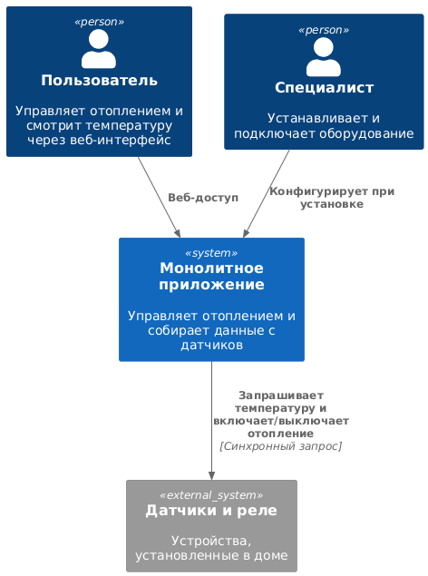
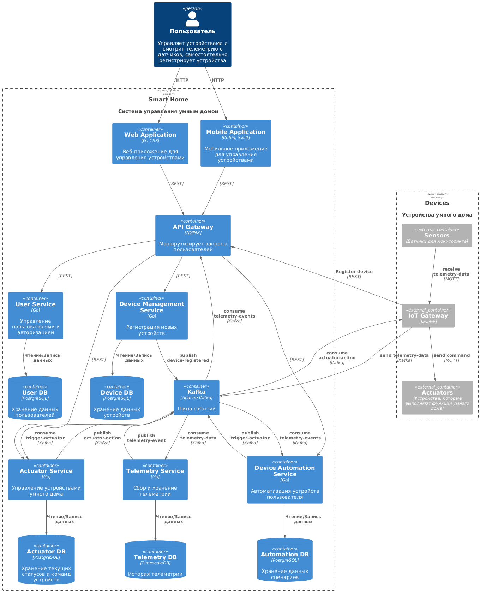
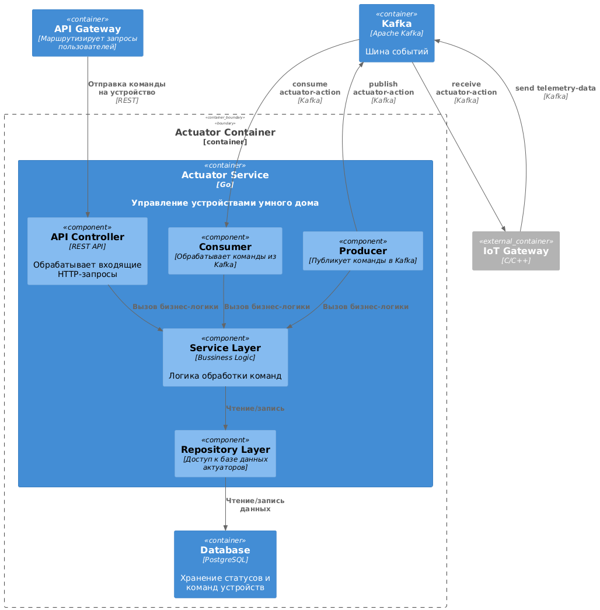
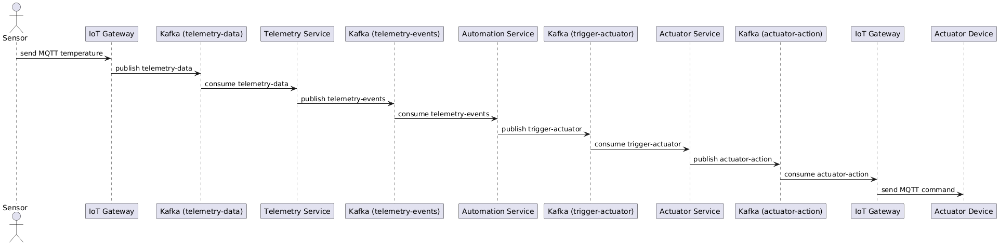
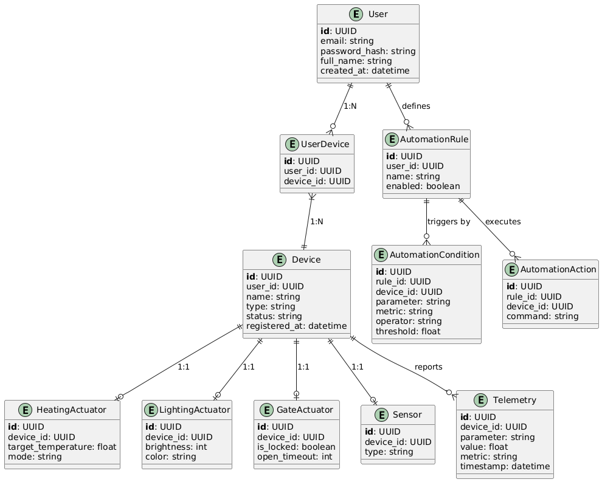

# Project_template

# Задание 1. Анализ и планирование

### 1. Описание функциональности монолитного приложения

**Управление отоплением:**

- включение и выключение отопления в доме

**Мониторинг температуры:**

- получение актуальных данных с установленного датчика

Система позволяет пользователю взаимодействовать через REST API — интерфейс реализован с использованием HTTP-запросов, документация предоставлена в виде Postman-коллекции.

### 2. Анализ архитектуры монолитного приложения

- Язык: Go (Golang) — основной язык реализации приложения.
- СУБД	PostgreSQL — используется для хранения информации о датчиках
- Архитектура: Монолитная — вся бизнес-логика, API и работа с БД в одном процессе
- Взаимодействие: Синхронное — последовательная обработка HTTP-запросов
- Масштабируемость: Ограниченная — масштабирование возможно только всей системы
- Развёртывание: Моно-блок — обновление требует остановки и перезапуска всего приложения

### 3. Определение доменов и границы контекстов

Домены (предметные области):
- Управление отоплением (Heating Management)

- Мониторинг температуры (Temperature Monitoring)

- Управление устройствами (Device Management)

- Пользователи и доступ (User Management)

Границы контекстов:
- Heating Control: Включение и выключение отопления
- Temperature Telemetry: Получение текущих данных с датчиков
- Device Connectivity: Управление добавлением/удалением/настройкой устройств
- User Management: Регистрация, авторизация, доступ к устройствам
### **4. Проблемы монолитного решения**

- Требуется пересборка и перезапуск всего приложения
- Изменения в одной части ломают всю систему
- Невозможно эффективно развёртывать в нескольких регионах
- Требуется выезд специалиста, что тормозит рост
- Сложно добавлять новые модули: освещение, ворота, видеонаблюдение

### 5. Визуализация контекста системы — диаграмма С4

# Задание 2. Проектирование микросервисной архитектуры

### Краткое текстовое описание взаимодействия
1. Пользователь через Web или Mobile App взаимодействует с API Gateway.
2. API Gateway маршрутизирует запросы к соответствующим микросервисам (User Service, Device Management Service, Actuator Service, Automation Service).
3. Device Management Service регистрирует устройства
4. IoT Gateway передаёт телеметрию через Kafka и получает сообщения на выполнение команд актуаторов.
5. Telemetry Service получает и сохраняет данные от устройств.
6. Automation Service следит за событиями и при необходимости инициирует команды для актуаторов.
7. Actuator Service принимает команды и публикует действия в Kafka для доставки на устройства.
8. Устройства получают команды через IoT Gateway по MQTT.
9. Все сервисы используют собственные БД, обеспечивая изоляцию данных и отказоустойчивость

<!-- ### Уровень контейнеров -->
**Диаграмма контейнеров (Containers)**

Диаграмма контейнеров отображает основные приложения (контейнеры) системы, их базу данных, а также взаимодействие между собой и с пользователем.

**Диаграмма компонентов (Components)**

Диаграмма компонентного уровня описывает внутреннюю структуру микросервиса `Actuator Service`.

**Диаграмма кода (Code)**

Для уровня кода сделана диаграмма последовательности (Sequence Diagram), описывающую сценарий: автоматизация запуска отопления при снижении температуры ниже порога.

Сценарий:
1. Сенсор отправляет температуру через MQTT → IoT Gateway.
2. IoT Gateway публикует telemetry-data в Kafka.
3. Telemetry Service обрабатывает данные и публикует telemetry-events.
4. Automation Service обрабатывает событие и отправляет trigger-actuator.
5. Actuator Service принимает команду и публикует actuator-action.
6. IoT Gateway получает команду и передаёт её устройству.

# Задание 3. Разработка ER-диаграммы
Краткое описание основных сущностей:
- User — владеет одним или несколькими устройствами (Device) и настраивает автоматизации (AutomationRule).

- Device — базовая сущность для всех физических устройств. Может быть:

    - сенсором (Sensor),

    - актуатором: отопление (HeatingActuator), освещение (LightingActuator), ворота (GateActuator).

- Telemetry — данные, поступающие от устройства (сенсора или актуатора), с параметрами и метриками.

- AutomationRule — пользовательская логика сценариев.

    - содержит условия (AutomationCondition), основанные на телеметрии,

    - и действия (AutomationAction), отправляемые актуаторам.

- Каждое специализированное устройство имеет 1:1 связь с Device, что позволяет расширять логику без дублирования базовых данных.

